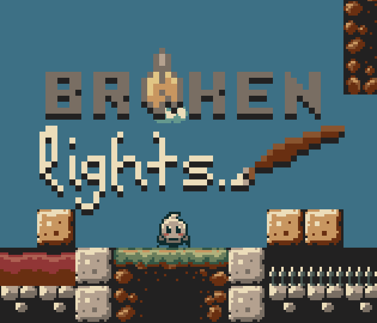
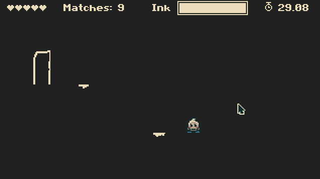
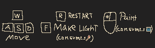

# Broken Lights - A PULS Game Jam 2025 Game
Made with <3 by NimbleBeasts with Godot 4.4

Game play footage

# Controls

# Creators

This game was a 48h solo adventure however I've used some third party stuff:

## Music

Music was created by Ozzed under CC BY-SA (https://creativecommons.org/licenses/by-sa/3.0/).
https://ozzed.net/
https://twitter.com/OzzedNet

## Shader

The rain shader was released under public domain here:
https://godotshaders.com/shader/simple-rain-snow-shader/

# TODOs
- [x] Sound
- [x] Ladder
- [x] Rain Shader?
- [x] Flame Trap
- [x] FallGuy
- [ ] 5 Levels
- [ ] Balancing
- [x] Itch Page
- [ ] More Enemies
- [ ] Moving Platforms

